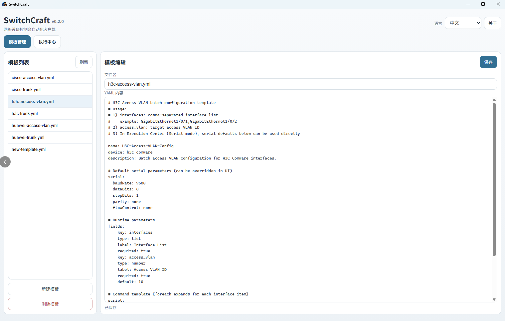
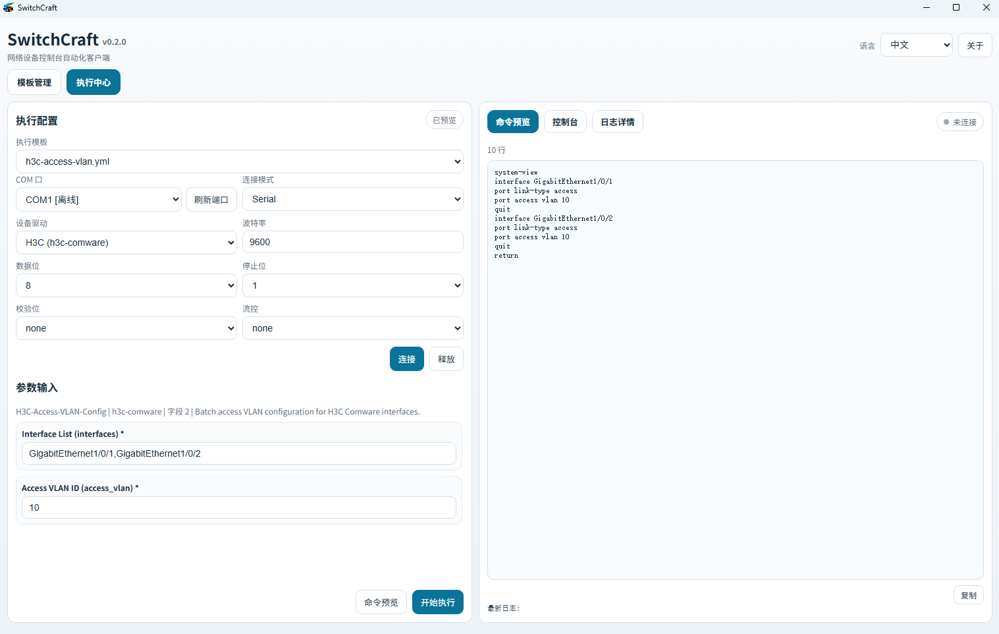

# SwitchCraft

[English](./README.md) | **中文**

<p align="center">
  
</p>

SwitchCraft 是一个面向网络设备控制台自动化的 Electron 桌面工具。
它将模板编辑、参数输入、命令预览和执行整合为一套图形化工作流，同时保留可复用的自动化执行内核。

## 项目简介

SwitchCraft 适合需要在控制台侧重复执行网络变更的工程场景。
你可以基于 YAML 模板组织命令，在界面里填写运行参数，先预览渲染后的命令，再通过串口或 Mock 模式执行。

## 页面截图

### 模板工作区



### 执行中心



## 功能特性

- 基于 Electron 的桌面图形界面
- YAML 模板管理：列表、新建、编辑、保存、删除
- 根据模板字段自动生成运行参数表单
- 执行前命令预览
- 串口模式与 Mock 模式
- 设备驱动抽象（如 `h3c-comware`）
- 执行日志与启动阶段耗时诊断
- 主进程离线优先保护

## 技术栈

- Node.js + TypeScript
- Electron
- `js-yaml`
- `serialport`（用于真实 COM 口）

## 许可证

本项目使用 Apache License 2.0，详见 [LICENSE](./LICENSE)。

## 快速开始

```bash
npm install
npm run build
npm start
```

## README 图片资源

请将 README 用到的图片放到以下路径：

- `docs/readme/icon.png`
- `docs/readme/screenshot-template-workspace.png`
- `docs/readme/screenshot-execution-center.png`

后续只要替换同名文件，README 就会自动显示新图片。

## 常用脚本

- `npm run build`: 编译 TypeScript 到 `dist/`
- `npm start`: 启动 Electron（通过 `prestart` 先构建）
- `npm run dist:win`: 打包 Windows NSIS 安装版
- `npm run dist:win-portable`: 打包 Windows 便携版
- `npm run cli`: 运行 `dist/src/index.js` 的 CLI

## 真实串口使用

启动后进入 **Execution Center**，点击 **Refresh Ports** 扫描本机 COM 口。

CLI 示例：

```bash
npm run cli -- --port COM3 --driver h3c-comware --template templates/h3c-trunk.yml --params templates/demo-params.mjs
```

Mock 示例：

```bash
npm run cli -- --mock
```

## 配置说明

默认运行配置文件位置：

- Windows: `%APPDATA%/SwitchCraft/settings.json`
- Linux/macOS: Electron `userData` 目录

常见配置项：

- `locale`
- `offlineMode`
- 串口默认参数（`baudRate`、`dataBits`、`stopBits`、`parity`、`flowControl`）

## 启动耗时诊断

启动阶段日志写入：

- `<userData>/logs/startup-timing.log`

可用它定位“进程启动前”延迟（例如安全软件扫描导致的双击启动慢）。

## 项目结构

- `electron/main.ts`: 主进程与 IPC
- `electron/preload.ts`: 渲染桥接
- `renderer/index.html`: 界面结构
- `renderer/app.js`: 交互与状态管理
- `src/session.ts`: 会话状态机
- `src/template.ts`: 模板解析/校验/渲染
- `src/executor.ts`: 执行引擎
